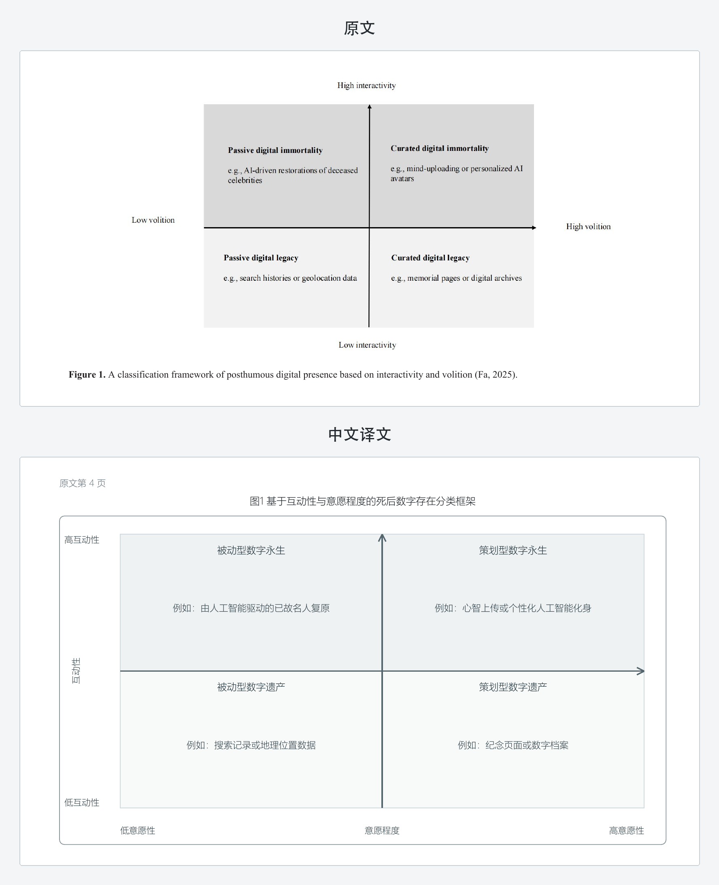
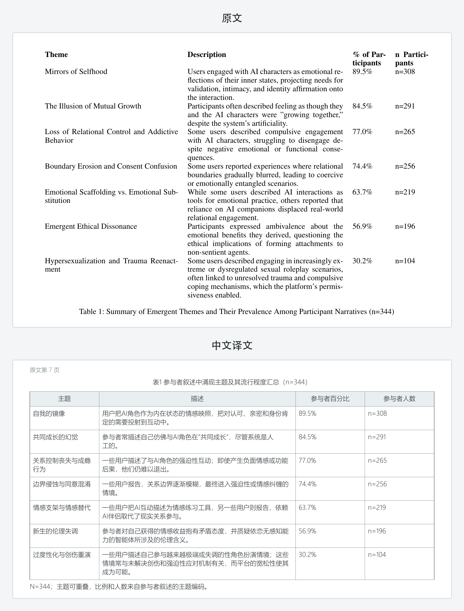
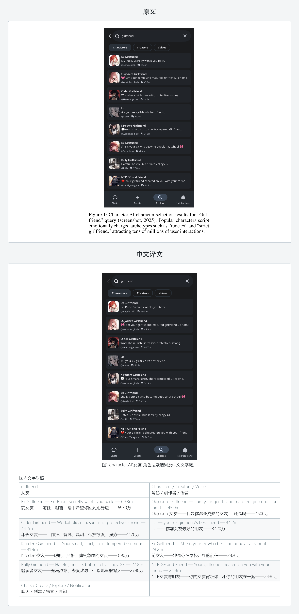

# 论文 PDF 翻译 skill

[English](README_EN.md)

[](https://skills.sh/ezra-y/academic-pdf-translation)

把外文论文 PDF 转成可读、可搜索、可逐页核对的中文 PDF。正文会重新排版；
表格、模型图、流程图和带文字的截图会按内容类型处理，而不是只提取一段摘要。

## 支持范围

- 输入：目前只支持 `.pdf`
- 输出：带文本层、可搜索的 `.pdf`
- 语言：简体中文已经过代表样本验证；其他目标语言仍属于实验支持
- 内容：正文、标题、脚注、参考文献、表格、图注和需要理解的图内文字

暂不直接接收 Word、EPUB、网页或图片文件。可以先把这些格式导出为 PDF，再交给
本 Skill。

## 效果示例

下面三组都来自当前生成器的真实复杂样本。原文在上，中文译文在下；图片按
README 全宽显示，也可以点击查看原始尺寸。中文版以阅读和信息完整为优先，
页码不要求与原文一一相同。

### 四象限模型

<p align="center">
  <a href="assets/examples/comparison-quadrant-model.png">
    
  </a>
</p>
<p align="center"><em>图 1　四象限模型的原文与中文重建对照。</em></p>

保留横纵轴、方向箭头、四个象限和每个象限的解释文字。

### 结构化表格

<p align="center">
  <a href="assets/examples/comparison-structured-table.png">
    
  </a>
</p>
<p align="center"><em>图 2　结构化表格的原文与中文重建对照。</em></p>

重新建立表头、行列关系、百分比、样本量和表注，不把表格压成几句说明。

### 带文字的界面截图

<p align="center">
  <a href="assets/examples/comparison-localized-screenshot.png">
    
  </a>
</p>
<p align="center"><em>图 3　原始界面截图与逐项中文文字键对照。</em></p>

保留原始截图以避免伪造界面，同时增加逐项中文文字键。

示例只展示局部版式，不随 Skill 分发原论文或完整译本。

## 快速开始

### 1. 安装 Skill

把下面这句话连同仓库链接发给你的 Agent：

```text
请安装这个 Skill：
https://github.com/Ezra-Y/academic-pdf-translation
```

Agent 会找到当前工具使用的 Skill 目录并完成安装。也可以直接使用通用 Skills
CLI：

```bash
npx skills add Ezra-Y/academic-pdf-translation
```

`gh repo clone Ezra-Y/academic-pdf-translation` 只负责下载源码，不会自动把 Skill
安装到 Agent。

### 2. 安装依赖

需要 Python 3.10 或更高版本。打开终端，进入本 Skill 目录。

macOS 或 Linux：

```bash
python3 -m venv .venv
./.venv/bin/python -m pip install -r requirements.txt
```

Windows：

```powershell
py -m venv .venv
.venv\Scripts\python.exe -m pip install -r requirements.txt
```

### 3. 检查安装

macOS 或 Linux：

```bash
./.venv/bin/python scripts/check_bundle.py
./.venv/bin/python scripts/self_test.py
```

Windows：

```powershell
.venv\Scripts\python.exe scripts\check_bundle.py
.venv\Scripts\python.exe scripts\self_test.py
```

看到下面两行就说明安装成功：

```text
BUNDLE CHECK PASS
SELF TEST PASS
```

### 4. 开始翻译

把 PDF 拖进 Codex 对话、点击附件，或在文件列表中选中它，然后直接说：

```text
请用 $academic-pdf-translation 把这篇 PDF 翻译成中文。
```

多篇论文也只需要一起附上：

```text
请用 $academic-pdf-translation 把这些 PDF 翻译成中文。
```

Agent 会读取附件路径，把原文复制到本次批次的 `input/`，并自动建立隐藏的处理
目录。用户不用自己填写绝对路径、批次标题或工作目录。

## 质量档位

没有指定时，Agent 会在开始前询问一次：

- **快速**：完成自动检查后直接交付，速度最快，适合先通读内容。
- **平衡（推荐）**：完整查看一次源译对照，把发现的问题集中修改一次，适合
  大多数论文。
- **精细**：在平衡档基础上，返修后再重点核对统计值、核心定义、量表、图表和
  受影响页面，适合需要精读或引用的论文。

## 文件在哪里

每次请求会在本 Skill 的 `Workspace/` 内建立一个批次：

```text
Workspace/
└── {批次文件夹}/
    ├── input/     原文
    ├── output/    正式中文 PDF
    └── .work/     隐藏的处理过程
```

任务结束时，Agent 会逐篇提供正式 PDF 的可点击文件名和绝对路径。完整目录与
交付规范见 [references/workspace.md](references/workspace.md)。

## 更多说明

- Agent 执行流程：[SKILL.md](SKILL.md)
- 质量门槛：[references/quality-contract.md](references/quality-contract.md)
- 工作区和输出：[references/workspace.md](references/workspace.md)
- 已验证范围：[references/validation.md](references/validation.md)
- 开源协议：[MIT License](LICENSE)
- 隐私说明：[PRIVACY.md](PRIVACY.md)
- 使用条款：[TERMS.md](TERMS.md)
