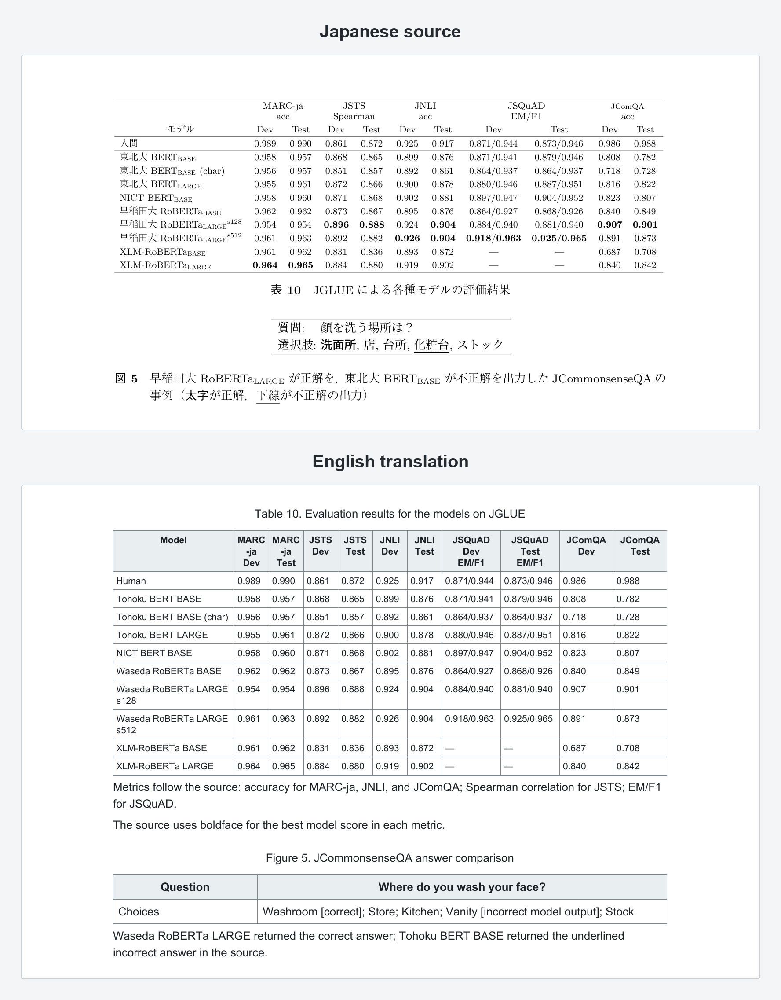

# Paper PDF Translation Skill

[简体中文](README.md)

[](https://skills.sh/ezra-y/academic-pdf-translation)

Translate research-paper PDFs into readable, searchable PDFs in another
language. The Skill rebuilds the reading layout instead of returning a summary.
It can handle body text, tables, model diagrams, flowcharts, captions, notes,
and figures whose text is needed to understand the paper.

## Support

- Input: `.pdf` only
- Output: searchable `.pdf` with a text layer
- Languages: Simplified Chinese has been validated on representative papers;
  English and other target languages are experimental and should be checked on
  representative pages before a large batch
- Content: titles, body text, footnotes, references, tables, captions, and
  meaningful text inside figures

Word, EPUB, web pages, and image files are not accepted directly. Export them
to PDF first.

## Example

### Japanese source to English output

<p align="center">
  <a href="assets/examples/comparison-japanese-to-english-jglue.png">
    
  </a>
</p>
<p align="center"><em>Figure 1. Japanese source and searchable English reconstruction of a dense benchmark table and QA example.</em></p>

This real example was generated with the current renderer. The source appears
above the English translation at full README width. It rebuilds an 11-column
benchmark table and a boxed QA example as searchable English text without
dropping any model, split, metric, or value.

Source: Kurihara, Kawahara, and Shibata, “JGLUE: Japanese General Language
Understanding Evaluation,” p. 76,
[J-STAGE](https://www.jstage.jst.go.jp/article/jnlp/30/1/30_63/_article/-char/en),
licensed under
[CC BY 4.0](https://creativecommons.org/licenses/by/4.0/).
Only the representative comparison image is included here; the source paper is
not redistributed with this Skill.

## Quick Start

### 1. Install the Skill

Send this repository to your Agent:

```text
Please install this Skill:
https://github.com/Ezra-Y/academic-pdf-translation
```

The Agent will find the Skill directory used by the current tool and complete
the installation. You can also use the cross-agent Skills CLI:

```bash
npx skills add Ezra-Y/academic-pdf-translation
```

`gh repo clone Ezra-Y/academic-pdf-translation` downloads the source but does
not install it into an Agent.

### 2. Install Dependencies

Python 3.10 or later is required. Open a terminal in this Skill directory.

macOS or Linux:

```bash
python3 -m venv .venv
./.venv/bin/python -m pip install -r requirements.txt
```

Windows:

```powershell
py -m venv .venv
.venv\Scripts\python.exe -m pip install -r requirements.txt
```

### 3. Check the Installation

macOS or Linux:

```bash
./.venv/bin/python scripts/check_bundle.py
./.venv/bin/python scripts/self_test.py
```

Windows:

```powershell
.venv\Scripts\python.exe scripts\check_bundle.py
.venv\Scripts\python.exe scripts\self_test.py
```

A working installation prints:

```text
BUNDLE CHECK PASS
SELF TEST PASS
```

### 4. Translate a PDF

Attach a PDF in Codex and say:

```text
Please use $academic-pdf-translation to translate this PDF into English.
```

For several papers, attach them together and say:

```text
Please use $academic-pdf-translation to translate these PDFs into English.
```

The Agent finds the attachment paths, copies the source files into the current
batch workspace, and creates the hidden processing files automatically.

## Quality Modes

When no mode is specified, the Agent asks once before starting:

- **Fast**: deliver after automatic checks; best for an initial read.
- **Balanced (recommended)**: review the complete source-output comparison once,
  then apply one consolidated repair.
- **Precise**: use the balanced workflow, then recheck key statistics,
  definitions, scales, tables, and affected pages.

## Output Location

Each request creates one batch inside this Skill's `Workspace/` directory:

```text
Workspace/
└── {batch-folder}/
    ├── input/     source PDFs
    ├── output/    translated PDFs
    └── .work/     hidden processing files
```

When the task finishes, the Agent returns a clickable filename and absolute
path for every translated PDF.

## License

Released under the [MIT License](LICENSE).
