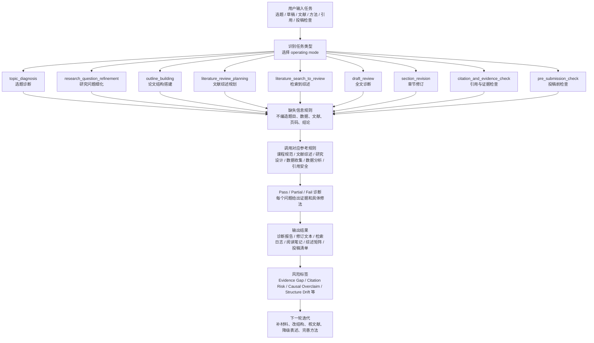
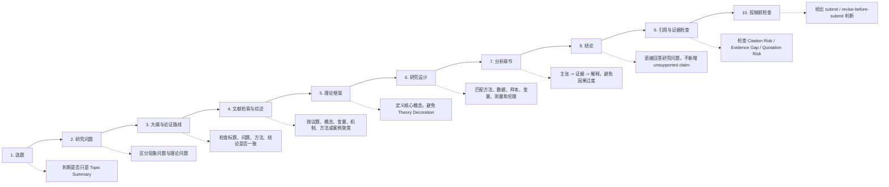

# Social Science Paper Writing Skill 分享说明

这份文档可以直接作为 GitHub 仓库的 `README.md` 初稿，也可以拆成小红书图文内容。

## 一句话介绍

`social-science-paper-writing` 是一个面向社会科学论文写作的 Codex/ChatGPT skill，用于辅助完成选题诊断、研究问题细化、论文大纲搭建、文献综述规划、CNKI/Google Scholar 到 Zotero 的文献工作流、草稿评审、章节修订、引用与证据风险检查，以及投稿前检查。

它的核心目标不是“把文字润色得更像论文”，而是帮助作者把论文写成一个可检验、可论证、证据和方法相匹配的社会科学研究。

## 适合谁使用

- 正在写课程论文、毕业论文、开题报告或期刊论文的社会科学学生与研究者。
- 选题还停留在“大主题”，需要转化为具体研究问题的人。
- 文献综述容易写成“作者 A 说、作者 B 说”的人。
- 方法、数据、变量、样本、案例边界不够清楚的人。
- 担心引用、数据、因果表述或证据支撑不可靠的人。
- 想把 CNKI、Google Scholar、Zotero 和论文写作流程连起来的人。

## 核心工作流



## 论文写作阶段流程图



## 九种 operating modes

| Mode | 用途 | 典型输出 |
|---|---|---|
| `topic_diagnosis` | 判断一个选题是否有研究价值、可行性和证据基础 | 选题评分、问题标签、2-4 个改题方向 |
| `research_question_refinement` | 把宽泛主题转化为问题导向的研究问题 | 问题陈述、候选研究问题、证据需求和风险 |
| `outline_building` | 搭建或修复从标题到结论的论文结构 | 章节大纲、每章任务、结构漂移提示 |
| `literature_review_planning` | 规划文献综述的检索范围、聚类方式和 gap | 文献簇、纳入逻辑、gap statement |
| `literature_search_to_review` | 从 CNKI/Google Scholar 检索、筛选、导入 Zotero 到写综述 | 检索日志、结构化笔记、综述矩阵、综述草稿 |
| `draft_review` | 诊断整篇论文的论证、结构、文献、方法和证据 | 全文诊断报告、Pass/Partial/Fail 表格、优先修改项 |
| `section_revision` | 修订某一章节或段落 | 修订文本、修改记录、剩余证据缺口 |
| `citation_and_evidence_check` | 检查引用、数据、引文、因果词和证据支撑 | claim-risk 表格、安全改写建议 |
| `pre_submission_check` | 投稿或提交前的最终检查 | 阻断问题、润色问题、submit/revise 判断 |

## 设计原则

### 1. 问题意识优先

这个 skill 会优先判断论文是不是在回答一个真实的研究问题，而不是只在介绍一个主题。它会标记：

- `Topic Summary`: 只是综述话题，没有解决问题。
- `Weak Problem Consciousness`: 问题意识模糊、出现太晚或不重要。
- `Research Question Missing`: 看不出明确研究问题。
- `Research Question Too Broad`: 问题过大，超出篇幅、数据或方法能力。

### 2. 文献综述服务于研究问题

文献综述不是“按作者罗列”，而应该组织成学术对话。这个 skill 会要求文献按以下逻辑聚类：

- 争论或理论流派
- 核心概念
- 变量、机制或解释路径
- 方法类型
- 案例、地区或时期
- 研究缺口与本研究问题的关系

### 3. 方法、数据和主张必须匹配

skill 会检查研究设计是否回答得了研究问题，包括：

- 方法是否适合问题。
- 数据、样本、案例、语料、时间范围是否清楚。
- 概念是否被操作化为变量、指标、编码类别或解释程序。
- 分析方法是否匹配变量层级和比较结构。
- 结论是否超出证据和设计能力。

### 4. 引用与证据安全

skill 明确禁止伪造文献、数据、页码、DOI、样本量、访谈、统计结果和法律文件。它会区分：

- `Evidence Gap`: 主张缺少证据。
- `Citation Risk`: 引用缺失、不可核验、二手转引或与主张不匹配。
- `Quotation Risk`: 直接引语缺少原文、引号或页码。
- `Causal Overclaim`: 因果语言超过研究设计支持范围。

### 5. 来源状态分级

在文献检索和 Zotero 工作流中，skill 会区分：

- `candidate source`: 候选文献。
- `metadata only`: 只有元数据。
- `abstract only`: 只读了摘要。
- `full text read`: 已读全文。
- `in Zotero`: Zotero 中已有记录。
- `imported to Zotero`: 已导入 Zotero。

这可以避免“有 Zotero 记录就当作已经读过”的常见风险。

## 可直接复制的使用示例

### 选题诊断

```text
请使用 social-science-paper-writing skill，帮我诊断这个选题是否适合写一篇社会科学课程论文：
题目：短视频平台对大学生政治参与的影响
要求：指出问题意识、研究对象、可行性、证据风险，并给出 3 个更聚焦的选题方向。
```

### 研究问题细化

```text
请把下面这个主题转化为 3-4 个可研究的问题，并说明每个问题需要什么数据和方法：
主题：社区治理中的数字平台使用。
```

### 文献综述规划

```text
请帮我规划一篇关于“基层政府数字化转型与公共服务响应性”的文献综述。
请给出中文和英文关键词、文献聚类方式、纳入排除标准、可能的研究缺口。
```

### 全文诊断

```text
请按 draft_review 模式诊断我的论文草稿。
重点检查：研究问题、文献综述、理论框架、研究设计、证据链、因果表述和引用风险。
```

### 引用和证据检查

```text
请检查下面这一节的 Citation Risk、Evidence Gap 和 Causal Overclaim。
不要补造文献；如果证据不足，请给出安全表述。
```
