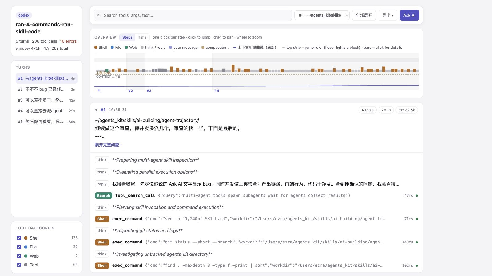

<h1 align="center">agent-trajectory</h1>

<p align="center">English | <a href="README.zh.md">中文</a></p>

<p align="center"></p>

<p align="center"><strong>See what your AI agent actually did — turn by turn, tool by tool, token by token.</strong></p>

<p align="center">Interface and interaction model based on the trajectory view in <a href="https://github.com/deepseek-ai/deepseek-harness">DeepSeek Harness</a>.</p>

<hr>

`agent-trajectory` turns a Claude Code or Codex session log (or normalized
`agent-trajectory/v1` JSON from another host) into a trajectory viewer: a
per-turn ledger of every tool call with
its arguments, result, duration and status; a zoomable timeline with a
context-window usage curve; and an optional **learn tier** where an AI annotates
every step — what the turn set out to do, why each pivotal call was made, and a
short storyline of what actually happened, failures included.

Built for people learning how agents work under the hood, and for anyone who
wants to review what an agent did on their machine.

## Highlights

- **Two tiers.** *Raw* is pure log parsing — no model calls, instant.
  *Learn* adds AI-written annotations (per-turn goal, per-step why, per-turn
  storyline), grounded strictly in the parsed events so it can't invent steps.
- **Live mode.** `serve.py` watches the session log and updates the page while
  the agent works. Real-time, local, zero dependencies.
- **Ask AI.** Hover any step, press 问AI — the question lands in a notebook
  drawer. In live mode it's answered in-page by a local CLI (`claude -p` /
  `codex exec` / anything via `$AGENT_TRAJECTORY_ASK_CMD`); in a static page
  it's copied for pasting into any chat.
- **Self-contained output.** One HTML file, no network, no build step, light
  and dark, print-to-PDF ready. Send it to anyone.

## Quick start

```sh
# live view of your current session (run inside your project directory)
python3 serve.py --open

# or: one static HTML file
python3 parse_trajectory.py -o /tmp/traj.json
python3 render.py --data /tmp/traj.json -o trajectory.html
```

Everything is Python 3.9+ stdlib. Nothing leaves your machine.

### As an Agent Skill

The repo doubles as a skill: `SKILL.md` tells a host agent (Claude Code, Codex,
or anything that reads skills) how to run the pipeline and — for the learn
tier — how to write the annotations JSON. Install it wherever your agent looks
for skills, then say "show me this session's trajectory" or ask for the
"learn / annotated" version.

## How it works

```
session log (JSONL)          annotations (learn tier, AI-written)
      │                                  │
parse_trajectory.py  ──►  trajectory JSON (agent-trajectory/v1)
      │                                  │
      └── render.py ── static HTML ◄─────┘
      └── serve.py ─── live HTML + /api/trajectory + /api/ask + /export
```

Session discovery is automatic per host (newest session for the current
working directory):

| Host | Default location | Override |
|---|---|---|
| Claude Code | `~/.claude/projects/<munged-cwd>/*.jsonl` | `$CLAUDE_CONFIG_DIR` |
| Codex | `~/.codex/sessions/**/rollout-*.jsonl` (matched by cwd) | `$CODEX_HOME` |
| any file | — | `--session <path>` / `$AGENT_TRAJECTORY_SESSION` |

## The normalized schema (`agent-trajectory/v1`)

```jsonc
{
  "schema": "agent-trajectory/v1",
  "host": "claude-code",
  "session": { "id": "...", "path": "...", "cwd": "...", "title": "..." },
  "context_window": 200000,          // tokens, when the host reports it
  "turns": [{
    "index": 1,
    "user_text": "...",              // what the user asked
    "started": 1755200000000, "ended": 1755200600000,
    "subagent_events": 0,            // sidechain traffic, tallied not expanded
    "events": [{
      "id": "t1e3",                  // stable anchor for annotations
      "kind": "tool",                // tool | assistant | thinking | user_note
                                     // | context | system | compaction
      "ts": 1755200001000,
      "tool": "Bash", "args": "{...}", "result": "...",
      "status": "ok",                // ok | error | null (no result recorded)
      "duration_ms": 2000,
      "context_tokens": 129097       // context footprint after this request
    }],
    "stats": { "events": 20, "tool_calls": 17, "errors": 1,
               "duration_ms": 681000, "context_end": 129097 }
  }]
}
```

Annotations are a separate JSON keyed by turn index and event id — see
`SKILL.md` for the exact contract and the honesty rules the annotating agent
must follow (grounded in parsed events; failures never smoothed over).

## Adding a host adapter

1. Write `parse_<host>(path)` in `parse_trajectory.py` returning the schema
   above (look at `parse_claude` / `parse_codex` — ~100 lines each).
2. Register it in `discover()` if sessions can be found automatically.
3. Add a fixture test in `tests/test_parse.py`.

The viewer, live server, annotations, and exports work unchanged.

## Design

Typography, color tokens, and the tool-category palette live in
[DESIGN.md](DESIGN.md). The categorical palette (MCP / Shell / Skill / File /
Web / Agent) passes a colorblind-safety and contrast validator in both light
and dark mode, and category color never appears without a text label.

## Acknowledgements

The interface structure and interaction model, including the two-level
overview and step-detail panel, are based on the trajectory view in
[DeepSeek Harness](https://github.com/deepseek-ai/deepseek-harness).
DeepSeek Harness is an open-source agent harness developed by DeepSeek AI and
released under the MIT License. `agent-trajectory` adapts that experience for
portable Claude Code and Codex session logs and is not affiliated with
DeepSeek AI.

## License

[MIT](LICENSE)
